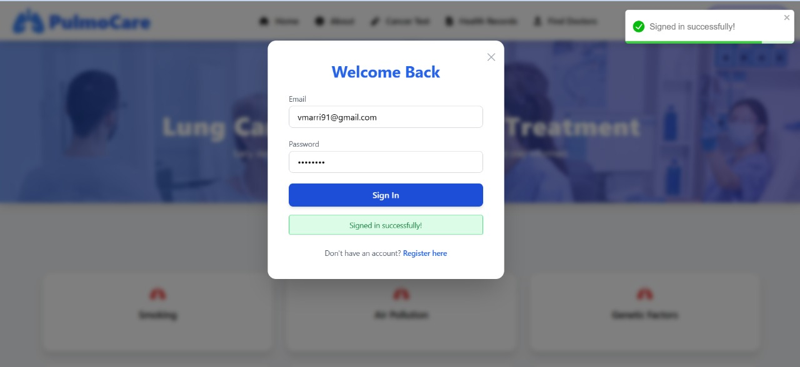
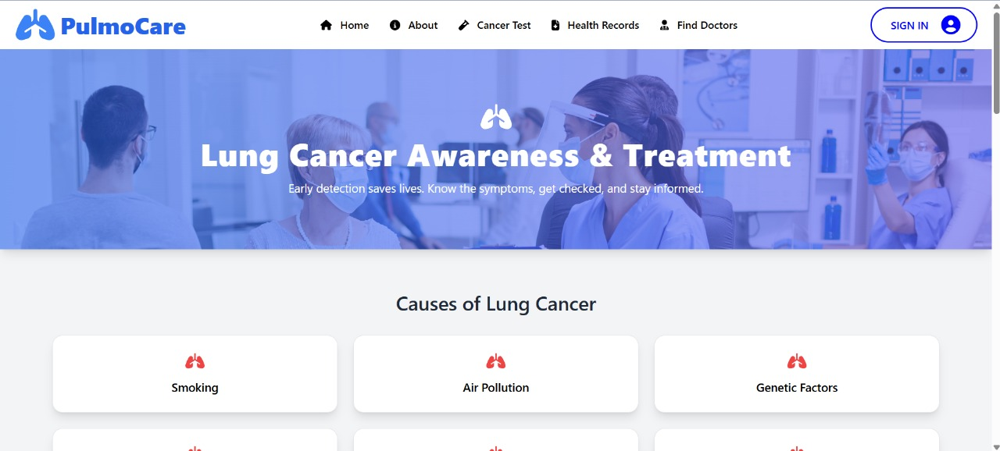
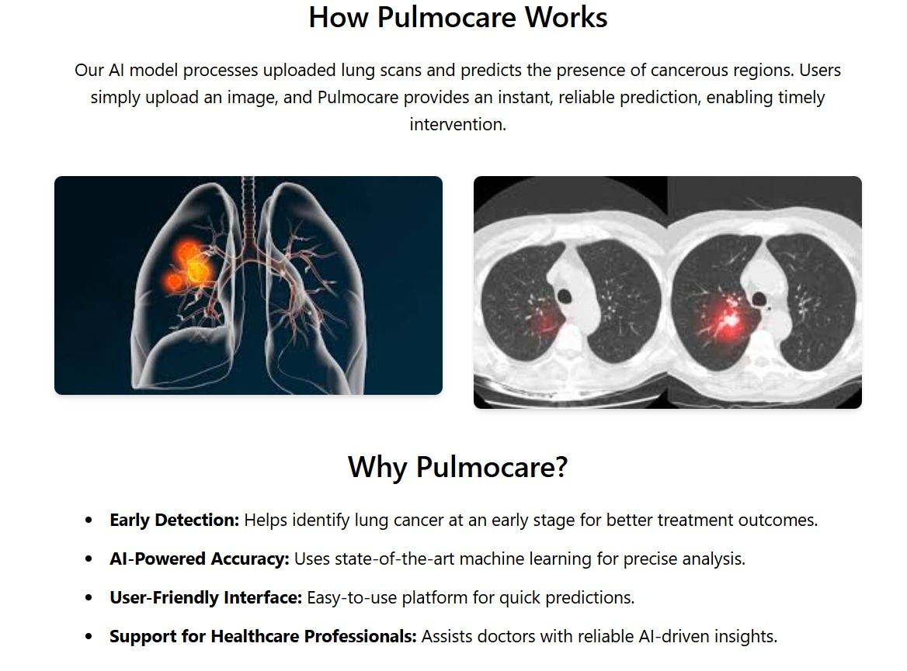

# PULMOCARE
PulmoCare is a Lung Cancer prediction Web-Application which allows users to predict lung cancer based on the X-ray report provided by user.

# Key Features:

-Interactive Website and landing page

-Interactive 3D model for providing education on lungs 

-Lungs cancer prediction

-Connect with doctors near you efficiently 

# Images

 

## Running the frontend

`cd fronted`

"""
npm start
"""